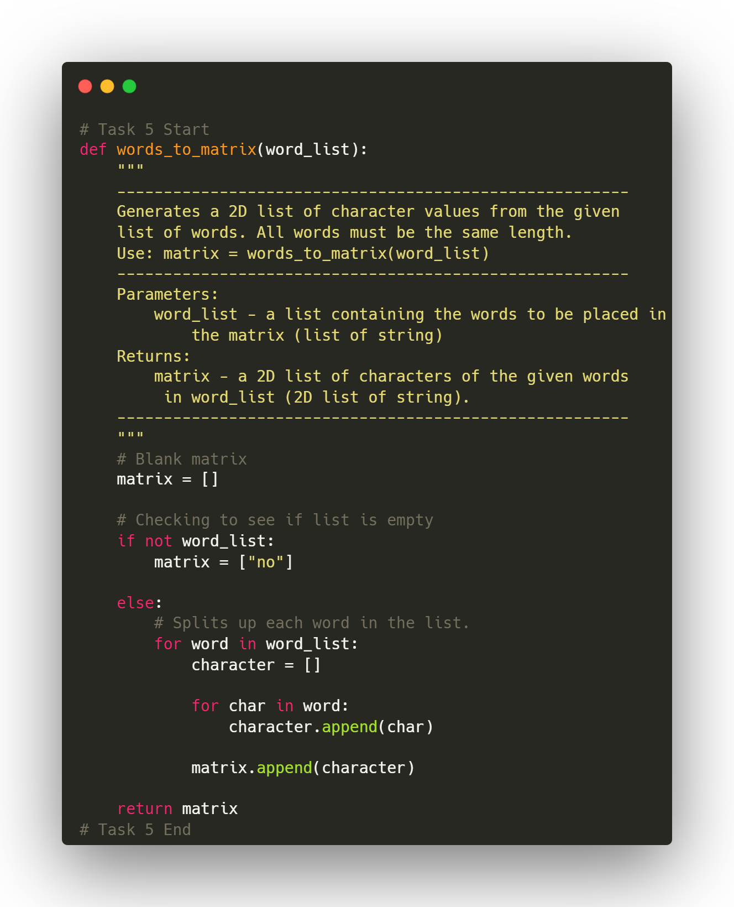

  

[Join My Discord](https://discord.gg/93JaCgBb5M)

[Written Study Guide For CP104 Students](https://docs.google.com/document/d/1qTgdZEJway8ytHJc6gYpoQlS6m_WNDy7nnYrXJL7jYI/edit?usp=sharing)

This is my first year assignments and labs I did in the CP104 course at WLU.

Each of these are from the 2023-2024 Fall Semester.
Some labs may not be included as they were worked on an assigned basis.
The questions will not be included as a part of the uploads. 

Most of the code will be formatted like this:

If you a part of this course, please make sure to not copy. [^1]
[^1]: Please keep in mind that I uploaded my code for reference purposes and it is my work. If this is used anywhere please be sure to credit this properly.

Thanks and enjoy <3
