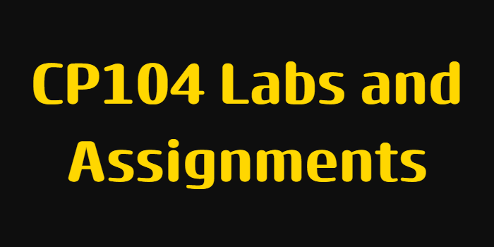

  

https://img.shields.io/discord/1183252580168638538?style=for-the-badge&color=purple&link=https%3A%2F%2Fdiscord.gg%2F93JaCgBb5M

This is my first year assignments and labs I did in the CP104 course at WLU.

Each of these are from the 2023-2024 Fall Semester.
Some labs may not be included as they were worked on an assigned basis.
The questions will not be included as a part of the uploads. 

If you a part of this course, please make sure to not copy but use this as reference material for future projects

Thanks and enjoy <3
